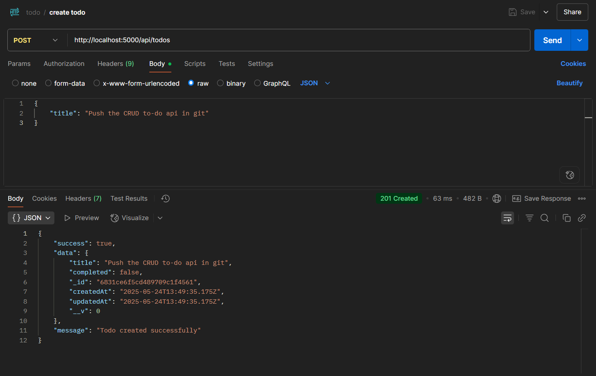
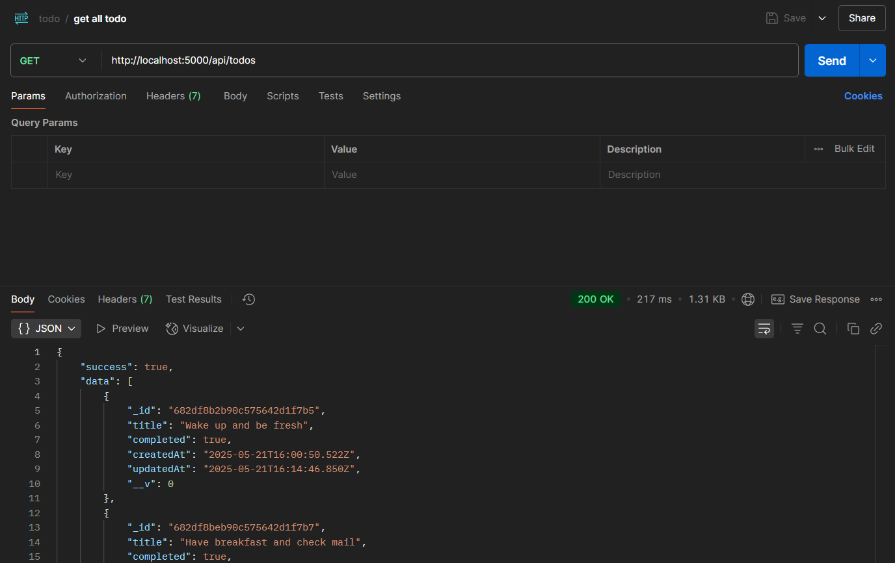
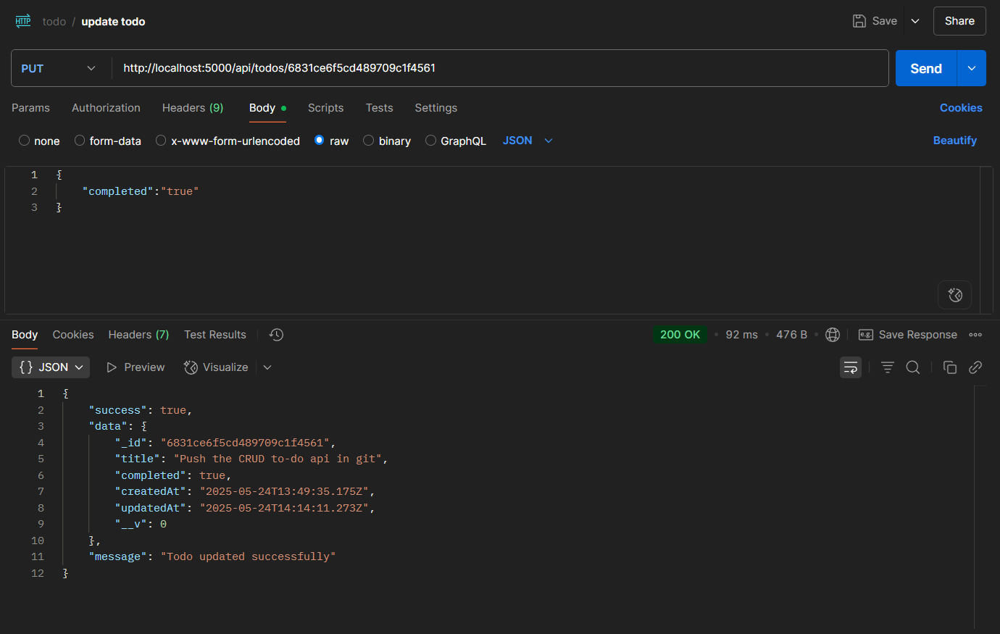
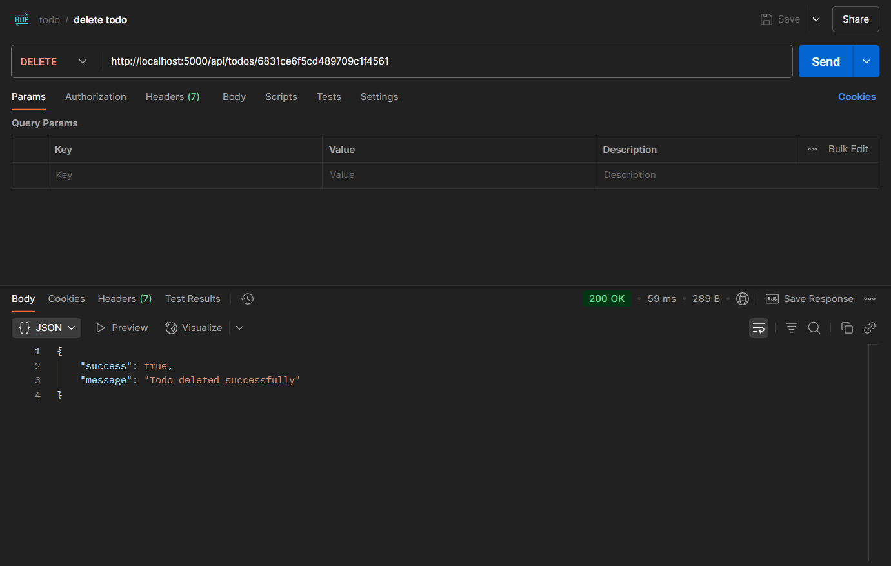

# 📝 Todo API

A simple and beginner-friendly CRUD API built with **Node.js**, **Express**, and **MongoDB** using **Mongoose**.

## 🚀 Features

- ✅ Create, Read, Update, and Delete Todo items
- 🧱 RESTful API structure
- 📦 MongoDB integration using Mongoose
- 🧪 Tested with Postman
- 🌱 Beginner-friendly and clean codebase

## 🛠️ Tech Stack

- Node.js
- Express.js
- MongoDB
- Mongoose
- dotenv

## 📮 API Endpoints

| Method | Route             | Description          |
|--------|-------------------|----------------------|
| POST   | `/api/todos`      | Create a new todo    |
| GET    | `/api/todos`      | Get all todos        |
| PUT    | `/api/todos/:id`  | Update a todo        |
| DELETE | `/api/todos/:id`  | Delete a todo        |

## 🔧 Setup Instructions

1. **Clone the repository**

    ```
    git clone https://github.com/Aashirwad10/todo-api.git
    cd todo-api
    ```
2. **Install dependencies**

    ```
    npm install
    ```

3. **Create `.env` file**

    - Create a `.env` file in the root folder
    - Add your MongoDB URI like this:

      ```
      MONGO_URI= mongodb+srv://abcdefghijklmnopqrstuvwxyz
      ```

4. **Run the server**

    ```
    npm run dev
    ```

Server runs on `http://localhost:5000` (or your specified port)

## 📸 API Examples
    
Here are some example requests and responses using Postman to demonstrate how the API works:

1. **POST create todo**
    - `http://localhost:5000/api/todos`  

    

2. **GET get all todo**
    - `http://localhost:5000/api/todos`  

    

3. **PUT update todo**
    - `http://localhost:5000/api/todos/6831ce6f5cd489709c1f4561`  

    

4. **DEL delete todo**
    - `http://localhost:5000/api/todos/6831ce6f5cd489709c1f4561`  

    


